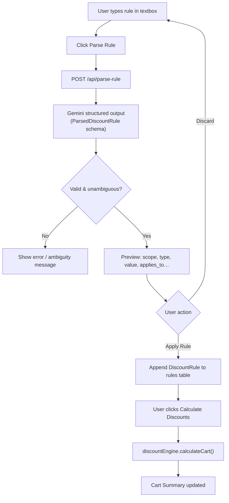
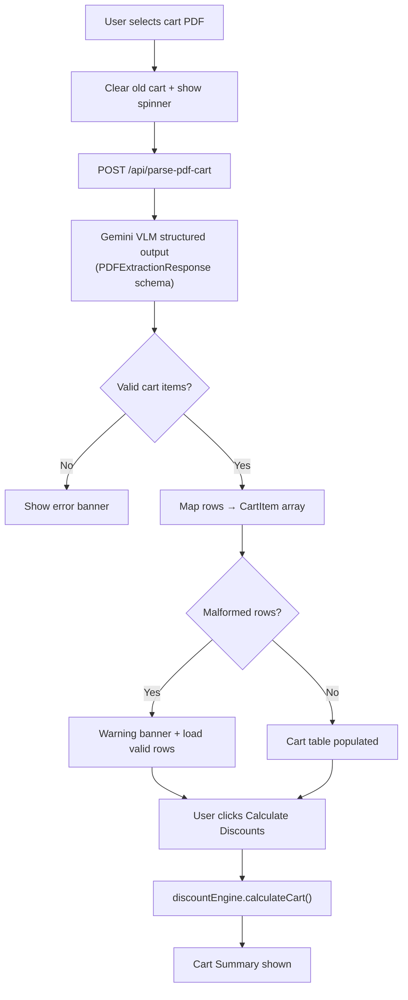

# Opptra Discount Engine

Customer-facing cart pricing engine — item-level discounts, cart-level offers, natural-language rules, and PDF cart upload.

**Live app:** [https://opptra-frontend.onrender.com](https://opptra-frontend.onrender.com)  
**API:** [https://discount-engine-assignment.onrender.com/docs](https://discount-engine-assignment.onrender.com/docs)  
**Repo:** [https://github.com/Hkrish098/discount-engine-assignment](https://github.com/Hkrish098/discount-engine-assignment)

Deployed on [Render](https://render.com) — frontend (static site) + backend (FastAPI).

---

## Run locally (3 steps)

### Step 1 — Install dependencies & configure API key

```bash
cd frontend && npm install
```

```bash
cd backend
python3 -m venv .venv
source .venv/bin/activate
pip install -r requirements.txt
cp .env.example .env
```

Add your Gemini key to `backend/.env`:

```env
GOOGLE_API_KEY=your_key_here
USE_LLM_PARSER=true
USE_VLM_PARSER=true
GEMINI_MODEL=gemini-3.5-flash
```

For local frontend → deployed API (optional), create `frontend/.env.local`:

```env
VITE_API_URL=https://discount-engine-assignment.onrender.com
```

> `backend/.env` and `frontend/.env.local` are gitignored — never commit API keys.

---

### Step 2 — Start the backend (terminal 1)

```bash
cd backend
source .venv/bin/activate
uvicorn app.main:app --reload --port 8000
```

Docs: http://localhost:8000/docs

---

### Step 3 — Start the frontend (terminal 2)

```bash
cd frontend
npm run dev
```

Open http://localhost:5173

---

## How to use

1. Upload `frontend/sample-data/rules.csv` → rules table loads  
2. Upload `frontend/sample-data/cart.csv` **or** a cart PDF → cart table loads  
3. *(Optional)* Type a rule in plain English → **Parse Rule** → confirm → **Apply Rule**  
4. Click **Calculate Discounts** → Cart Summary with item offers + cart offer row  

| Input | What happens |
|-------|----------------|
| CSV | Parsed in the browser, instant |
| Natural language | Gemini parses → you confirm → rule appended to table |
| PDF cart | Gemini VLM extracts items, **replaces** the cart; malformed rows show a warning |

---

## Execution flows

### 1 — Cart-level discount (RULE-04)

Runs entirely in `discountEngine.js` after you click **Calculate Discounts**:

```
Item-level discounts  →  each row gets a final price
        ↓
Subtotal              →  sum of item finals (e.g. Rs.5,932)
        ↓
Cart rule check       →  subtotal ≥ min_cart_value? (Rs.4,000)
        ↓
Cart offer applied    →  10% of subtotal = Rs.593 off
        ↓
Final cart total      →  Rs.5,339
```

---

### 2 — Natural-language rule input



**Key point:** the engine never sees raw text — Gemini output is validated with Pydantic, mapped to `DiscountRule`, then confirmed by the user.

---

### 3 — PDF cart extraction



**Key point:** PDF **replaces** the entire cart. Summary is not shown until the user clicks **Calculate Discounts**.

---

## Expected results (sample CSVs + RULE-04)

| Item | Final price | Offer |
|------|-------------|-------|
| ITEM-01 | Rs.1,104 | Platform 15% off |
| ITEM-02 | Rs.629 | Brand Rs.150 + Platform 10% stacked |
| ITEM-03 | Rs.509 | Platform 15% off |
| ITEM-04 | Rs.2,499 | No offers available |
| ITEM-05 | Rs.382 | Platform 15% off |
| ITEM-06 | Rs.809 | Platform 10% off |

Cart subtotal **Rs.5,932** → RULE-04 **−Rs.593** → **Final Rs.5,339**

---

## Project structure

```
discount-engine-assignment/
├── frontend/                         # React + Vite UI
│   ├── sample-data/
│   │   ├── rules.csv
│   │   └── cart.csv
│   ├── src/
│   │   ├── api/
│   │   │   └── backendClient.js      # calls FastAPI translator
│   │   ├── components/
│   │   │   ├── CartUploader.jsx      # CSV + PDF cart upload
│   │   │   ├── CsvUploader.jsx
│   │   │   ├── NaturalLanguageRuleInput.jsx
│   │   │   └── ...
│   │   ├── engine/
│   │   │   ├── discountEngine.js     # pure discount math (no UI / no LLM)
│   │   │   ├── csvParser.js
│   │   │   ├── priceMath.js
│   │   │   └── ruleIds.js
│   │   └── App.jsx
│   ├── .env.example
│   └── package.json
│
├── backend/                          # FastAPI translator API
│   ├── app/
│   │   ├── main.py                   # CORS + routes
│   │   ├── config.py
│   │   ├── schemas.py
│   │   ├── models/
│   │   │   ├── parsed_rule.py        # LLM guardrail schema
│   │   │   └── pdf_extraction.py     # VLM guardrail schema
│   │   ├── routers/
│   │   │   ├── parse_rule.py         # POST /api/parse-rule
│   │   │   └── parse_pdf.py          # POST /api/parse-pdf-cart
│   │   └── services/
│   │       ├── gemini_parser.py      # NL → DiscountRule
│   │       ├── gemini_pdf_parser.py  # PDF → CartItem[]
│   │       ├── rule_mapper.py
│   │       └── pdf_cart_parser.py
│   ├── tests/
│   ├── .env.example
│   └── requirements.txt
│
└── README.md
```

**Architecture rule:** CSV, natural language, and PDF are translated into `DiscountRule` / `CartItem` objects before they reach `discountEngine.js`.

---

## Tests & build

```bash
cd frontend && npm test
```

```bash
cd backend && source .venv/bin/activate && pytest
```

```bash
cd frontend && npm run build
```

---

## Deployment (Render)

| Service | Root directory | Start command |
|---------|----------------|---------------|
| Frontend | `frontend` | `npm install && npm run build` (static publish `dist/`) |
| Backend | `backend` | `uvicorn app.main:app --host 0.0.0.0 --port $PORT` |

**Frontend env:** `VITE_API_URL=https://discount-engine-assignment.onrender.com`  
**Backend env:** `GOOGLE_API_KEY`, `USE_LLM_PARSER`, `USE_VLM_PARSER`, `GEMINI_MODEL`, `CORS_ORIGINS`

---

## Design decisions

- **Engine stays pure** — `discountEngine.js` only receives typed objects; NL/PDF never touch the calculator.
- **Direct Gemini + Pydantic** — structured JSON output with validation.
- **Backend for NL & PDF only** — discount math runs client-side.
- **PDF replaces cart; NL rules append** — per assignment semantics.
- **Manual Calculate** — user triggers summary after loading cart or adding rules.
